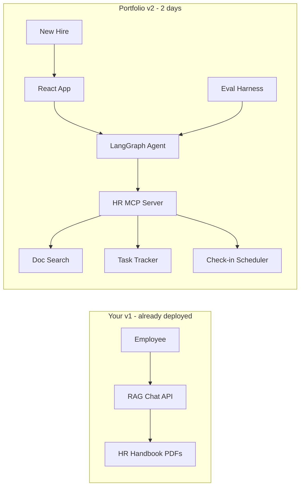

# Autonomous HR Onboarding Agent — 2-Day Portfolio Plan

## Why this project (not something generic)

The [Digital Workforce Senior AI Agent Developer role](https://careers.digitalworkforce.eu/jobs/7932451-senior-ai-agent-developer-to-our-office-in-helsinki/3eb1f06f-ff05-4a66-9305-302063d1cae1) is not looking for another chatbot. They explicitly want someone who can **build agents, write evals, ship Python + React end-to-end, and put systems into production for enterprise customers**.

Your advantage: you already shipped **v1** — a Django + LlamaIndex RAG API ([Backend_HR_Finland](file:///Users/hadi/dev/Backend_HR_Finland), deployed at `hr.433-cloud.com`) with org-scoped document Q&A, streaming, and multi-tenant HR categories. That is your "real LLM project" proof point.

**v2 in `hr-onboarding` should not rebuild v1.** It should show the senior leap: from *passive RAG* to an *autonomous agent that executes onboarding workflows* — with MCP tools, evals, and a React UI. That maps 1:1 to their Outsmart / Enterprise AI Agent positioning.



---

## Recommended project: **OnboardAI — Autonomous Employee Onboarding Agent**

**One-liner for CV/interview:** *"An autonomous HR onboarding agent that answers policy questions with citations, proactively creates a 30-day onboarding plan, tracks task completion, and schedules check-ins — with an automated eval suite measuring answer faithfulness and task-completion accuracy."*

This beats a generic "AI assistant" because it demonstrates **agentic behavior** (plan → act → verify), not just retrieval.

---

## Ruthless 2-day scope (what to build vs cut)

### Build (JD-aligned, interview-visible)

| JD requirement | How you demonstrate it |
|---|---|
| Build AI Agents | LangGraph ReAct agent with multi-step tool use |
| Agent Evals | 10–15 golden scenarios + automated scoring script |
| Python | FastAPI backend, agent orchestration, eval runner |
| Production-grade React | Chat UI + onboarding progress dashboard |
| MCP experience | Custom Python MCP server exposing HR tools |
| LLM + prompt engineering | System prompt with onboarding persona, citation rules, guardrails |
| Architect scalable systems | Clean monorepo: `backend/`, `mcp-server/`, `frontend/`, `evals/` |
| Real-world impact | Pre-seeded "Acme Corp" employee scenario with measurable completion % |

### Cut (save for "future work" slide in interview)

- Multi-tenancy, OAuth, user registration
- PDF upload pipeline (pre-seed 3–5 markdown/PDF docs instead)
- Newsletter, TTS, voting, admin CRUD from v1
- Persistent vector DB ops (use Chroma embedded — swap to pgvector in README "production path")
- Slack/HRIS real integrations (mock via MCP tools with realistic responses)

---

## Monorepo structure

```
hr-onboarding/
├── backend/           # FastAPI + LangGraph agent
├── mcp-server/        # Python MCP: HR tools
├── frontend/          # React + Vite chat + progress UI
├── evals/             # Golden dataset + runner
├── seed-data/         # Sample handbook, benefits, IT policy docs
├── docker-compose.yml
└── README.md          # Architecture, v1→v2 story, demo script, eval results
```

---

## Day 1 — Agent core (Python + MCP + evals)

### 1. Seed data (~1 hour)
Create realistic HR docs in `seed-data/`:
- `employee-handbook.md` — remote work, PTO, code of conduct
- `benefits-guide.md` — health insurance enrollment deadline
- `it-setup.md` — laptop, VPN, Slack channels
- `onboarding-checklist.md` — standard 30-day tasks

These become both RAG corpus and eval ground truth.

### 2. MCP server (~2 hours)
Python MCP server (`mcp-server/`) with 4 tools — enough to show autonomy:

- `search_handbook(query)` — RAG over seed docs, returns chunks + source citations
- `create_onboarding_task(title, due_day, category)` — writes to SQLite task store
- `list_onboarding_tasks(employee_id)` — returns task list with status
- `schedule_checkin(day, topic)` — mock calendar entry (returns confirmation)

This reuses your MCP experience and gives the agent **hands** — the key differentiator from v1.

### 3. LangGraph agent (~3 hours)
`backend/agent/onboarding_agent.py`:
- **State**: messages, employee context (role, start date), task list
- **Graph**: `agent → tools → agent` loop with max 5 iterations
- **System prompt**: onboarding buddy persona; must cite handbook sources; proactively suggest tasks for new hires; never invent policy
- **Trigger**: on first message from a new employee, agent auto-generates week-1 task plan

FastAPI endpoints:
- `POST /api/chat` — SSE streaming (reuse your v1 streaming pattern)
- `GET /api/onboarding/{employee_id}/status` — task completion % for React sidebar

**Stack:** FastAPI, LangGraph, OpenAI (gpt-4o-mini for speed/cost in demo), Chroma for embeddings.

### 4. Eval harness (~2 hours)
`evals/` — this is your **biggest JD differentiator**; most candidates skip it.

```
evals/
├── scenarios.yaml      # 10-15 test cases
├── run_evals.py        # CLI: python run_evals.py
└── results/            # JSON reports
```

Example scenarios:

```yaml
- id: remote_policy
  input: "Can I work from home on Fridays?"
  expect:
    cites_source: employee-handbook.md
    contains: ["remote", "policy"]
    no_hallucination: true

- id: proactive_tasks
  input: "I just started as a software engineer today"
  expect:
    tools_called: [create_onboarding_task]
    min_tasks_created: 3

- id: benefits_deadline
  input: "When do I need to enroll in health insurance?"
  expect:
    cites_source: benefits-guide.md
    answer_within_days: 30
```

Scoring (keep simple for 2 days):
- **Retrieval evals**: keyword + source-file match (deterministic)
- **Agent evals**: tool-call assertions (did it create tasks?)
- **Quality evals**: LLM-as-judge for faithfulness (1 call per scenario, ~$0.05 total)

Target: **>85% pass rate** — publish the number in README.

---

## Day 2 — React UI + polish + deploy

### 5. React frontend (~4 hours)
`frontend/` — Vite + React + Tailwind (or shadcn/ui for polish):

**Two-panel layout:**
- **Left: Chat** — streaming messages, citation chips linking to source docs, tool-call indicators ("Created task: Set up VPN")
- **Right: Onboarding Progress** — task checklist with completion %, due dates, category badges (IT / HR / Team)

Pre-load demo employee "Alex Chen, Software Engineer, Day 1" so reviewers can click and go.

Minimal but production-feeling: loading states, error boundaries, responsive layout.

### 6. Docker + deploy (~2 hours)
`docker-compose.yml` services: `backend`, `mcp-server`, `frontend`, optional `chroma`.

One-command start: `docker compose up`

Deploy to **Fly.io** or **Railway** (free tier, ~30 min setup) — gives you a live URL for the application form and interview screen-share.

### 7. README as interview weapon (~1 hour)
README sections recruiters and interviewers actually read:

1. **Problem** — "New hires ask the same 50 HR questions; HR teams manually track onboarding tasks"
2. **v1 → v2 evolution** — screenshot/link to `hr.433-cloud.com`, explain what v2 adds
3. **Architecture diagram** (mermaid)
4. **Eval results table** — scenario, pass/fail, score
5. **2-minute demo script** — exact clicks to show in interview
6. **Production roadmap** — pgvector, real Slack MCP, multi-tenant (shows senior thinking without building it)

---

## 2-minute interview demo script

1. Open live URL → "Alex Chen, Day 1" is pre-loaded
2. Ask: *"What's the remote work policy?"* → agent cites `employee-handbook.md`
3. Ask: *"I just started, what should I do this week?"* → agent creates 4–5 tasks, progress bar updates
4. Show eval output: *"We test 12 scenarios automatically; 11/12 pass on faithfulness and task completion"*
5. Close: *"v1 was RAG Q&A I deployed for a client. v2 adds autonomous workflow execution — the gap between a chatbot and an enterprise agent."*

---

## How this maps to Digital Workforce specifically

Digital Workforce sells **Enterprise AI Agents for business automation** to 200+ large orgs. Your project mirrors their customer problems:
- **Knowledge work automation** (handbook Q&A → task execution)
- **Measurable outcomes** (onboarding completion %)
- **Production mindset** (Docker, evals, deploy, observability hooks)
- **Customer-facing** (you can discuss how you'd gather feedback from HR stakeholders)

Finnish hybrid role (~2 days/week office) — showing you can explain technical tradeoffs to business stakeholders in README/demo script reinforces "clear communicator" from the JD.

---

## Tech choices (optimized for 2 days)

| Layer | Choice | Why |
|---|---|---|
| Agent framework | LangGraph | Industry standard; interviewers know it; explicit tool loop |
| API | FastAPI | Async SSE, fast to scaffold, OpenAPI auto-docs |
| MCP | `mcp` Python SDK | Official; matches your prior MCP work |
| Vector store | Chroma (embedded) | Zero infra; index seed docs in <1 min |
| Frontend | Vite + React + Tailwind | Fastest path to polished UI |
| Evals | YAML + pytest + optional LLM judge | Simple, reproducible, CI-ready |
| Deploy | Docker Compose + Fly.io | One live URL for application |

---

## Alternative projects (if you change your mind)

Only consider these if HR onboarding feels too close to v1:

1. **AgentOps Lite** — mini platform to register, run, and eval multiple agents (more "platform architect", less domain story)
2. **Invoice Processing Agent** — multi-step doc extraction + approval workflow (more "enterprise automation", less personal narrative)

For your situation (HR domain expertise + deployed v1 + 2 days), **OnboardAI is the strongest choice**.

---

## Success criteria (definition of done)

- [ ] Live demo URL works end-to-end
- [ ] Agent autonomously creates onboarding tasks from conversation
- [ ] MCP server with 4+ tools, agent uses them in multi-step flows
- [ ] React UI shows chat + task progress updating in real time
- [ ] Eval suite runs with published pass rate in README
- [ ] README tells v1→v2 story with architecture diagram
- [ ] GitHub repo is public and linked on CV/LinkedIn

---

## CV bullet (ready to paste after build)

> **OnboardAI** — Autonomous HR onboarding agent (Python, LangGraph, MCP, React). Multi-tool agent that answers policy questions with citations, generates 30-day onboarding plans, and tracks task completion. Includes automated eval suite (12 scenarios, faithfulness + tool-use scoring). Evolution of production RAG system deployed at hr.433-cloud.com. [GitHub] [Live Demo]
