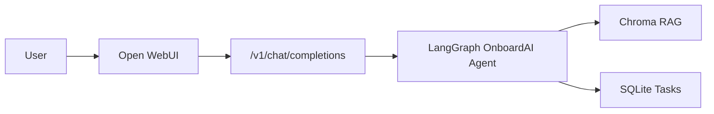

# Open WebUI Interface

Use [Open WebUI](https://github.com/open-webui/open-webui) as the chat interface for OnboardAI instead of (or alongside) the React frontend.

> **Important:** Production apps (`hr-onboarding`, `hr-onboarding-web`) must not be reused for PR previews. Use the **dev** Fly apps below.

## Dev vs production apps

| Role | Production | Dev / PR preview |
|------|------------|------------------|
| Backend API | `hr-onboarding` | `hr-onboarding-dev` |
| React UI | `hr-onboarding-web` | `hr-onboarding-web-dev` |
| Open WebUI | `hr-onboarding-webui` | `hr-onboarding-webui-dev` |

Config files:

- Production: `fly.toml`, `frontend/fly.toml`, `open-webui/fly.toml`
- Dev: `fly.dev.toml`, `frontend/fly.dev.toml`, `open-webui/fly.dev.toml`

## How it works



Open WebUI talks to OnboardAI through an **OpenAI-compatible API** added to the backend:

| Endpoint | Purpose |
|----------|---------|
| `GET /v1/models` | Lists the `onboardai` model |
| `POST /v1/chat/completions` | Runs the HR onboarding agent (streaming supported) |

---

## Local (Docker Compose)

```bash
cp .env.example .env
# Set OPENAI_API_KEY in .env

docker compose up --build
```

| Service | URL |
|---------|-----|
| Open WebUI | http://localhost:3000 |
| React UI | http://localhost:5173 |
| API docs | http://localhost:8000/docs |

On first launch, log in with `WEBUI_ADMIN_EMAIL` / `WEBUI_ADMIN_PASSWORD` from `.env` (defaults: `admin@example.com` / `admin`).

Select the **onboardai** model in the chat dropdown.

---

## Deploy to Fly.io

### 1. Backend (if not already deployed)

The backend must expose `/v1/*` endpoints. Deploy from repo root:

```bash
fly deploy --config fly.toml
fly secrets set OPENAI_API_KEY=sk-your-key-here --app hr-onboarding
fly secrets set ONBOARDAI_API_KEY=onboardai --app hr-onboarding
```

### 2. Create Open WebUI app

```bash
fly volumes create open_webui_data --region arn --size 1 --app hr-onboarding-webui
fly secrets set WEBUI_SECRET_KEY=$(openssl rand -hex 32) --app hr-onboarding-webui
fly secrets set WEBUI_ADMIN_EMAIL=you@example.com --app hr-onboarding-webui
fly secrets set WEBUI_ADMIN_PASSWORD='your-secure-password' --app hr-onboarding-webui
fly deploy --config open-webui/fly.toml
```

Open: **https://hr-onboarding-webui.fly.dev**

### 3. CI/CD (GitHub Actions)

A deploy token is required — do **not** use your Fly account password in GitHub.

```bash
fly tokens create deploy -x 999999h
```

Add the token as a GitHub repository secret named `FLY_API_TOKEN`.

On every push to `main`, `.github/workflows/deploy-fly.yml` deploys:

1. Backend (`hr-onboarding`)
2. Open WebUI (`hr-onboarding-webui`)
3. React frontend (`hr-onboarding-web`) — optional legacy UI

---

## Fly.io login (remote / headless environments)

`fly auth login` opens a browser, which often fails in cloud shells. Use one of these instead:

**Option A — API token (recommended for CI and agents):**

1. Open https://fly.io/user/personal_access_tokens in your browser
2. Create a token
3. Run: `export FLY_API_TOKEN=your-token-here`

**Option B — Email/password in terminal:**

```bash
fly auth login --email you@example.com --password 'your-password'
```

---

## Configuration reference

| Variable | Where | Purpose |
|----------|-------|---------|
| `OPENAI_API_BASE_URL` | Open WebUI | Points to `https://hr-onboarding.fly.dev/v1` |
| `OPENAI_API_KEY` | Open WebUI | Must match `ONBOARDAI_API_KEY` on backend |
| `ONBOARDAI_API_KEY` | Backend | Optional API key guard for `/v1/*` |
| `ENABLE_OLLAMA_API=false` | Open WebUI | Disables Ollama — we use OnboardAI backend only |
| `ENABLE_PERSISTENT_CONFIG=false` | Open WebUI | Forces env-based connection settings |

---

## Troubleshooting

| Problem | Fix |
|---------|-----|
| Open WebUI shows no models | Check backend `/v1/models` — `curl https://hr-onboarding.fly.dev/v1/models` |
| 401 Unauthorized | Ensure `OPENAI_API_KEY` in WebUI matches `ONBOARDAI_API_KEY` on backend |
| Cold start delay | Free tier stops machines when idle — first request takes ~10s |
| Can't open Fly login in Chrome | Use API token auth instead (see above) |
