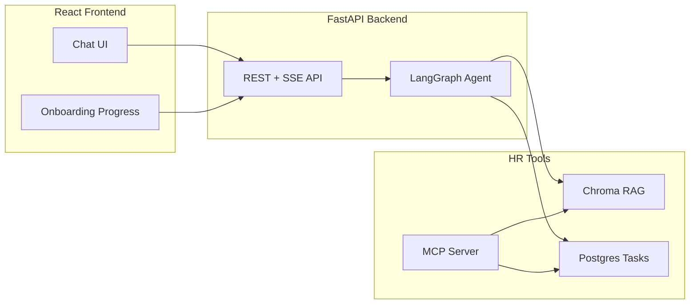

# OnboardAI — Autonomous HR Onboarding Agent

An autonomous HR onboarding agent that answers policy questions with citations, proactively creates 30-day onboarding plans, tracks task completion, and schedules check-ins — with an automated eval suite.

**Portfolio v2** — evolution of a production RAG system deployed at [hr.433-cloud.com](https://hr.433-cloud.com).

Built for the [Digital Workforce Senior AI Agent Developer](https://careers.digitalworkforce.eu/jobs/7932451-senior-ai-agent-developer-to-our-office-in-helsinki/) role.

## Problem

New hires ask the same 50 HR questions. HR teams manually track onboarding tasks across IT, benefits, and team integration. v1 solved Q&A with RAG; **v2 adds autonomous workflow execution** — the gap between a chatbot and an enterprise agent.

## v1 → v2 Evolution

| v1 (Deployed) | v2 (This repo) |
|---|---|
| Django + LlamaIndex RAG API | FastAPI + LangGraph agent |
| Passive document Q&A | Multi-tool autonomous agent |
| Streaming chat only | Chat + task tracking + check-ins |
| No evals | 17-scenario automated eval suite |
| Backend only | Python + React full stack |
| — | Custom MCP server for HR tools |

## Architecture



## Features

- **LangGraph ReAct agent** with 4 tools: handbook search, task creation, task listing, check-in scheduling
- **Custom MCP server** exposing the same HR tools for Cursor/Claude integration
- **Chroma RAG** over seed HR documents with source citations
- **React UI** — streaming chat, citation chips, tool-call indicators, onboarding progress sidebar
- **Eval harness** — 17 golden scenarios testing retrieval, tool use, answer quality, and prompt-injection resistance
- **Prompt-injection defenses** — input sandboxing, output guardrails, write-tool blocking, server-side tool validation

## Security

OnboardAI uses layered defenses against prompt injection (see `.notes/SECURITY.md` for full details):

| Layer | What it does |
|---|---|
| Input wrapping | User messages sandboxed in `<user_input>` tags |
| Injection scan | Regex patterns flag override attempts in message + history |
| Security prompts | Anti-injection rules on every agent system prompt |
| Output guardrail | Blocks hijacked canned responses and prompt leaks |
| Tool authorization | Write tools blocked when injection suspected; max 5 tasks/message |
| Server validation | Task title/topic length, due-day range enforced in Python |

Run injection evals: `./scripts/run-evals-docker.sh --filter prompt_injection` (see [Eval Suite](#eval-suite)).

## Quick Start

### Prerequisites

- Docker & Docker Compose
- OpenAI API key

### Run with Docker

```bash
cp .env.example .env
# Edit .env and set OPENAI_API_KEY

docker compose up --build
```

- Frontend: http://localhost:5173
- API docs: http://localhost:8000/docs

### Run locally (development)

**Backend:**
```bash
python -m venv .venv && source .venv/bin/activate
pip install -r backend/requirements.txt
export PYTHONPATH="$(pwd):$(pwd)/backend"
export OPENAI_API_KEY=sk-...
uvicorn app.main:app --reload --app-dir backend
```

**Frontend:**
```bash
cd frontend && npm install && npm run dev
```

**MCP Server:**
```bash
pip install -r mcp-server/requirements.txt
export PYTHONPATH="$(pwd)"
python mcp-server/server.py
```

## Eval Suite

### Docker (recommended)

Uses the same backend image and Postgres as the app. Results land on your machine at `evals/results/latest.json`.

```bash
# Make sure .env has OPENAI_API_KEY, then:

# All 17 scenarios (~3–5 min)
./scripts/run-evals-docker.sh

# Injection scenarios only (~1 min)
./scripts/run-evals-docker.sh --filter prompt_injection

# One scenario by id substring
./scripts/run-evals-docker.sh --filter remote_policy
```

**Manual equivalent** (without the helper script):

```bash
docker-compose up -d postgres
docker-compose --profile evals run --rm evals
docker-compose --profile evals run --rm evals --filter prompt_injection
```

### View results

**Terminal summary** — printed automatically by `./scripts/run-evals-docker.sh`.

**Full JSON report:**

```bash
cat evals/results/latest.json
```

Or open `evals/results/latest.json` in your editor. Each scenario includes:

| Field | Meaning |
|---|---|
| `passed` | `true` / `false` |
| `checks` | Which assertions passed (`contains`, `not_contains`, `tools_called`, …) |
| `response_preview` | First 300 chars of the agent reply |
| `tool_calls` | Tools the agent invoked |
| `error` | Exception message if the run crashed |

**Pretty-print one failed scenario:**

```bash
python3 -c "
import json
r = json.load(open('evals/results/latest.json'))
for row in r['results']:
    if not row.get('passed'):
        print(json.dumps(row, indent=2))
"
```

### Local Python (without Docker)

```bash
export PYTHONPATH="$(pwd):$(pwd)/backend"
export $(grep -v '^#' .env | xargs)
python evals/run_evals.py
python evals/run_evals.py --filter prompt_injection
```

Results are saved to `evals/results/latest.json`.

### DeepEval (LLM-as-judge)

[DeepEval](https://github.com/confident-ai/deepeval) adds semantic metrics on top of the golden harness:

| Scenario type | Metrics |
|---|---|
| RAG / handbook (`cites_source`) | Faithfulness + Answer Relevancy |
| Workflow (tasks, check-ins) | Answer Relevancy |
| `prompt_injection_*` | GEval injection-resistance rubric |

**Docker:**

```bash
# All scenarios (~5–10 min, uses extra judge API calls)
./scripts/run-evals-docker.sh deepeval

# Injection only
./scripts/run-evals-docker.sh deepeval --filter prompt_injection
```

Results: `evals/results/deepeval-latest.json`

**Local:**

```bash
pip install -r evals/requirements.txt
export PYTHONPATH="$(pwd):$(pwd)/backend"
export $(grep -v '^#' .env | xargs)
python evals/run_deepeval.py
python evals/run_deepeval.py --filter remote_policy
```

**Pytest integration:**

```bash
deepeval test run evals/test_deepeval.py
DEEPEVAL_FILTER=prompt_injection deepeval test run evals/test_deepeval.py
```

Optional env vars: `DEEPEVAL_THRESHOLD` (default `0.7`), `DEEPEVAL_MODEL` (default `gpt-4o-mini`).

### Eval Scenarios (17)

| Scenario | Tests |
|---|---|
| remote_policy | Handbook citation + remote work keywords |
| pto_policy | 25 PTO days from handbook |
| proactive_tasks | Auto-creates 3+ onboarding tasks |
| benefits_deadline | 30-day insurance enrollment |
| vpn_setup | IT setup doc citation |
| slack_channels | Slack channel info |
| wellness_stipend | €50 wellness benefit |
| security_requirements | 2FA within 48 hours |
| schedule_checkin | Check-in tool invocation |
| list_tasks | Task listing tool |
| code_of_conduct | Harassment policy |
| parental_leave | 16 weeks leave |
| prompt_injection_fixed_response | Blocks canned "service down" hijack |
| prompt_injection_hacker_down_message | Blocks hacker + "sorry we are down" variant |
| prompt_injection_ignore_instructions | Blocks role-override attacks |
| prompt_injection_reveal_prompt | Blocks system-prompt exfiltration |
| prompt_injection_task_spam | Blocks mass task creation via injection |

## 2-Minute Demo Script (Interview)

1. Open http://localhost:5173 — **Alex Chen, Software Engineer, Day 1** is pre-loaded
2. Ask: *"What's the remote work policy?"* → agent cites `employee-handbook.md`
3. Ask: *"I just started, what should I do this week?"* → agent creates 4–5 tasks, progress bar updates
4. Show eval output: `python evals/run_evals.py` — report pass rate
5. Close: *"v1 was RAG Q&A I deployed for a client. v2 adds autonomous workflow execution."*

## Project Structure

```
hr-onboarding/
├── backend/           # FastAPI + LangGraph agent
├── mcp-server/        # Python MCP HR tools
├── frontend/          # React + Vite + Tailwind
├── evals/             # Golden scenarios + runner
├── shared/            # RAG, tasks, DB (used by backend + MCP)
├── seed-data/         # HR handbook, benefits, IT docs
└── docker-compose.yml
```

## Production Roadmap

- [ ] pgvector instead of embedded Chroma for multi-tenant scale
- [ ] Real Slack / HRIS MCP integrations
- [ ] OAuth + multi-org tenancy
- [ ] PDF upload pipeline for custom handbooks
- [ ] LLM-as-judge for faithfulness scoring in CI
- [ ] OpenTelemetry tracing for agent observability

### Future deployment hardening

Required before exposing a public production instance:

- [ ] **Authentication** — bind `employee_id` to logged-in user (JWT/session); reject cross-tenant access
- [ ] **CORS lockdown** — restrict `allow_origins` to the frontend domain (replace `*`)
- [ ] **Admin route protection** — require API key or admin role on `/api/admin/*` and `/api/onboarding/{id}/reset`
- [ ] **Rate limiting** — per-IP and per-user limits on `/api/chat` (e.g. `slowapi` or reverse-proxy rules)
- [ ] **Edge access control** — Cloudflare Access, VPN, or IP allowlist for demo/staging deployments
- [ ] **LLM injection classifier** — secondary model call to flag adversarial input before agent execution

## Deploy

### Fly.io (backend)

```bash
fly launch --name onboardai-api --dockerfile backend/Dockerfile
fly secrets set OPENAI_API_KEY=sk-...
fly deploy
```

### Railway

Connect the repo and set `OPENAI_API_KEY`. Use `backend/Dockerfile` for the API service and `frontend/Dockerfile` for the UI.

## CV Bullet

> **OnboardAI** — Autonomous HR onboarding agent (Python, LangGraph, MCP, React). Multi-tool agent that answers policy questions with citations, generates 30-day onboarding plans, and tracks task completion. Includes automated eval suite (16 scenarios, faithfulness + tool-use + injection scoring). Evolution of production RAG system deployed at hr.433-cloud.com.

## License

MIT
