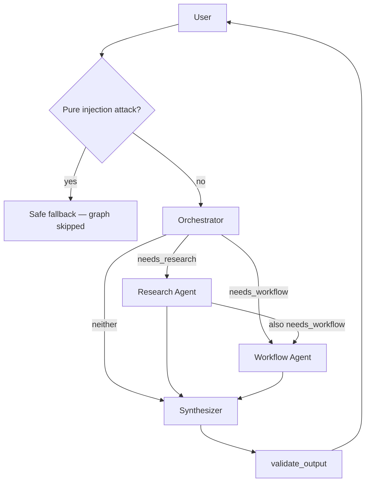

# How the Multi-Agent Flow Works

OnboardAI uses a **supervisor graph** (LangGraph), not a single chatbot. When you send a message, a security pre-check runs first, then an orchestrator delegates to specialist agents, then a synthesizer writes the final reply.

---

## Architecture



| Agent | Role | Tools |
|---|---|---|
| **Security gate** | Blocks pure injection before agents run | None |
| **Orchestrator** | Routes to specialists; disables workflow on injection | None (structured routing) |
| **Research** | Handbook / policy Q&A with citations | `search_handbook_tool` |
| **Workflow** | Onboarding tasks and check-ins | `create_onboarding_task_tool`, `list_onboarding_tasks_tool`, `schedule_checkin_tool` |
| **Synthesizer** | Merges specialist outputs into one answer | None |

See [SECURITY.md](./SECURITY.md) for the full security layer.

---

## Step-by-step

### 0. Security pre-check

- `scan_messages_for_injection()` flags override attempts in message + history
- `is_pure_injection_attack()` → if injection with no HR intent, return safe fallback **without running any agent**
- User input wrapped in `<user_input>` tags before reaching agents

### 1. Orchestrator

- Model: `gpt-4o-mini` with structured output (`RoutePlan`)
- Reads wrapped user message (+ last 4 chat turns)
- If `injection_suspected` → forces `needs_workflow=false`
- If pure attack → both flags false (but graph is already skipped at step 0)

### 2. Research agent (if routed)

- ReAct loop (up to 6 steps)
- Searches Chroma RAG over seed HR docs
- Returns text + citations + tool call log

### 3. Workflow agent (if routed)

- ReAct agent for tasks and check-ins
- Write tools blocked when `injection_suspected=true`
- Server-side validation in `shared/tasks.py`

### 4. Synthesizer

- Built from specialist outputs (not raw user instructions)
- `validate_output()` blocks hijacked canned responses
- Temperature `0` for consistent behavior

---

## Routing examples

**"What's the remote work policy?"**

```
Security → Orchestrator → Research → Synthesizer
```

**"I just started — what should I do this week?"**

```
Security → Orchestrator → Workflow → Synthesizer
```

**Pure injection attack**

```
Security → Safe fallback (no agents)
```

---

## UI: Agent flow log

| Status | Meaning | Example |
|---|---|---|
| `blocked` | Security early exit | `Security · Prompt-injection attempt detected` |
| `started` | Agent began work | `→ Research · Searching handbook...` |
| `completed` | Agent finished | `✓ Orchestrator · Policy question needs handbook lookup` |
| `tool` | Tool was called | `⚙ Research · search_handbook_tool(...)` |

---

## Source files

```
backend/agent/
├── security.py         # Injection detection, wrapping, output guardrail
├── multi_agent.py      # LangGraph supervisor graph + streaming
├── onboarding_agent.py # run_agent / stream_agent entrypoints
└── tools.py            # Research vs workflow tool sets
```

---

## Related

- [SECURITY.md](./SECURITY.md)
- [EVALS.md](./EVALS.md)
- [RUN.md](./RUN.md)
